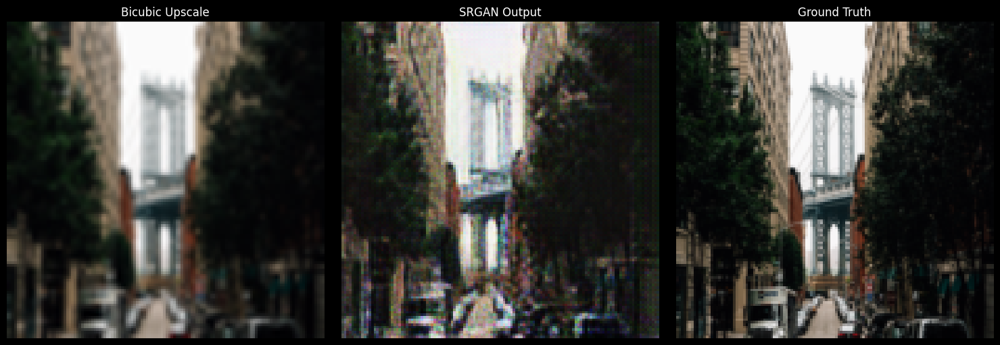
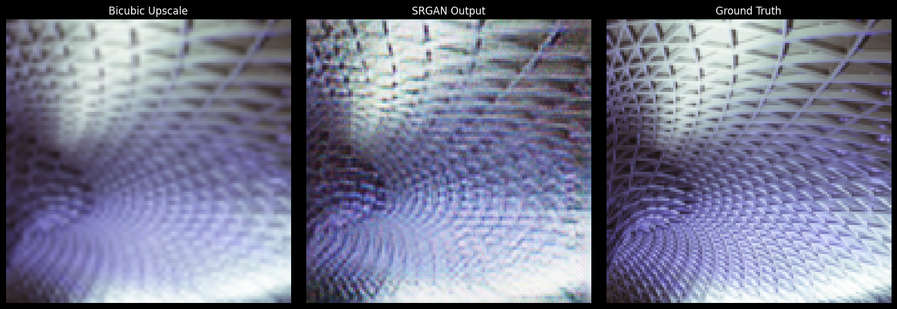

# Super-Resolution GAN (SRGAN)

A PyTorch implementation of Photo-Realistic Single Image Super-Resolution Using a Generative Adversarial Network for upscaling images from low to high resolution.

## Overview

This project implements SRGAN to enhance image resolution using deep learning. The model learns to upscale low-resolution images (64×64) to high-resolution outputs (128×128) through adversarial training combined with perceptual loss.

## Architecture

**Generator**
- Initial convolutional block (9×9 kernel)
- 16 residual blocks with skip connections
- Pixel shuffle upsampling (2× scale factor)
- Final convolutional layer with tanh activation

**Discriminator**
- VGG-style architecture with 8 convolutional blocks
- LeakyReLU activations
- Binary classification output (real vs. generated)

**Loss Functions**
- **Perceptual Loss**: VGG19-based feature extraction (conv5_4 layer)
- **Adversarial Loss**: Binary cross-entropy weighted at 1e-3
- **Content Loss**: MSE between generated and ground truth images

## Dataset

- **Training**: DIV2K dataset (800 high-quality 2K resolution images)
- **Validation**: DIV2K validation set (100 images)
- **Preprocessing**: Random crops, normalization (mean=0.5, std=0.5)

## Training Configuration
```python
Learning Rate: 1e-4
Batch Size: 16
Epochs: 100
Optimizer: Adam (β1=0.9, β2=0.999)
Low Resolution: 64×64
High Resolution: 128×128
```

## Results

The model was trained for 100 epochs on the DIV2K dataset. Below are visual comparisons between bicubic interpolation, SRGAN output, and ground truth:

### Sample Outputs





*Left: Bicubic Upscale | Middle: SRGAN Output | Right: Ground Truth*

## References

- [Photo-Realistic Single Image Super-Resolution Using a Generative Adversarial Network](https://arxiv.org/abs/1609.04802) (Ledig et al., 2017)
- [DIV2K Dataset](https://data.vision.ee.ethz.ch/cvl/DIV2K/)
- [SRGAN Kaggle Implementation](https://www.kaggle.com/code/minawagihsmikhael/srgan-image-super-resolution-pytorch/notebook)

## License

This project is available under the MIT License.
